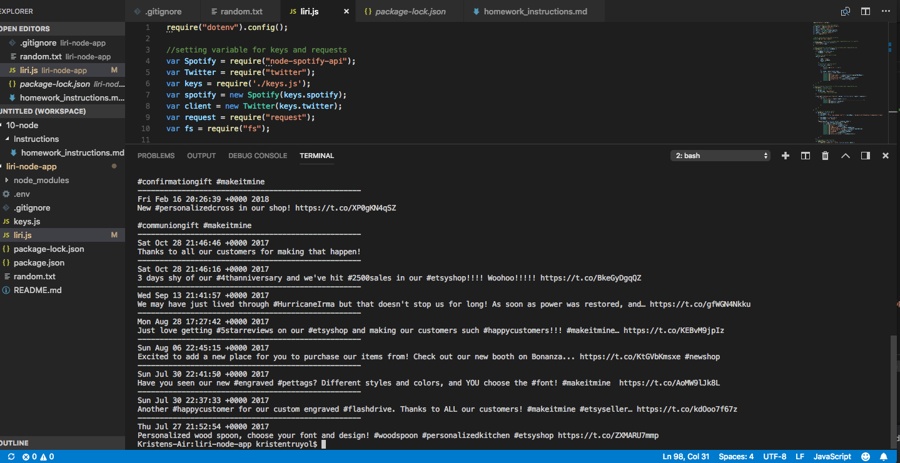
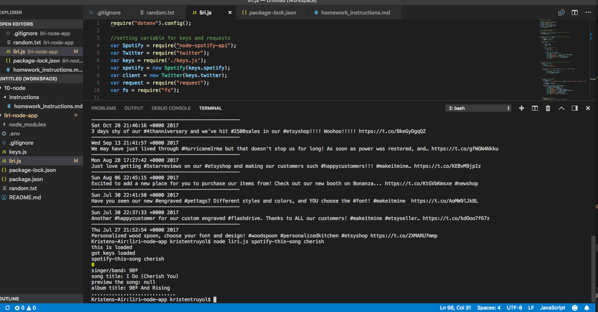
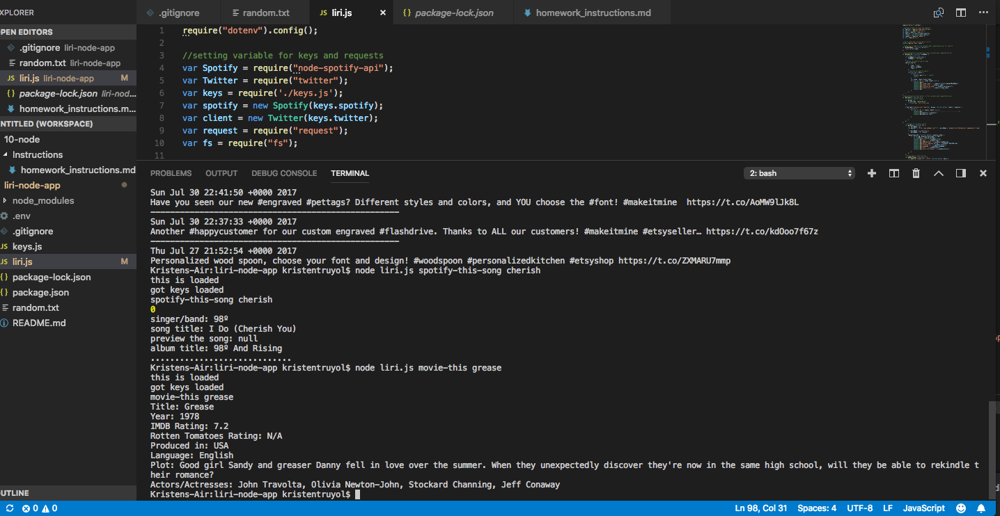
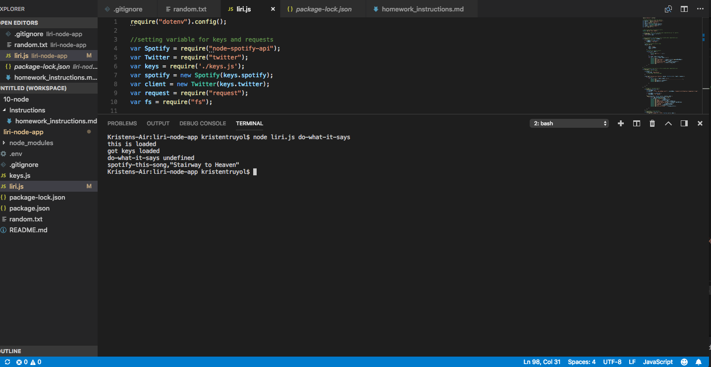

<h1>Liri Node App</h1>

LIRI is like iPhone's SIRI. However, while SIRI is a Speech Interpretation and Recognition Interface, LIRI is a Language Interpretation and Recognition Interface. LIRI will be a command line node app that takes in parameters and gives you back data.

LIRI has 4 commands:

<ul>
    <li>my-tweets</li>
    <li>spotify-this-song</li>
    <li>movie-this</li>
    <li>do-what-it-says</li>
</ul>

The "my-tweets" command will display the last 20 tweets from my twitter account, as well as when they were created. The "spotify-this-song <song name>" command will utilize the Spotify API to display the artist(s), song name, preview link of the song from Spotify, and the album name the song was featured in. If the user does not enter a song name, the command will default to "The Sign" by Ace of Base. The "movie-this" command uses OMDB's API to return information about the movie the user inputs ("movie-this <movie name>"), including title, year released, IMDB and Rotten Tomatoes Rating (if applicable), short plot, and more. If no movie name is entered in by the user, the return will default to "Mr. Nobody". Finally, "do-what-it-says" utilizes the "fs" node package to take text in the random.txt file to call LIRI's "spotify-this-song" command. It will display the song "Stairway to Heaven".

To run this app, user will need to supply his/her own .env file with its own API keys.

 
<h4>my-tweets</h4>
 

 
<h4>spotify-this-song</h4>
 

 
<h4>movie-this</h4>
 

 
<h4>do-what-it-says</h4>
 

 

<h3>Technologies Used:</h3>
<ul>
    <li>Javascript</li>
    <li>Node.js</li>
    <li>Twitter API</li>
    <li>Spotify API</li>
    <li>OMDB API</li>
</ul>